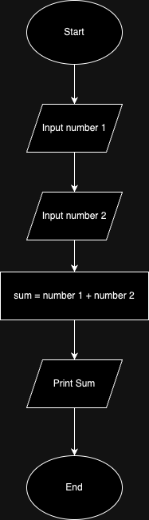
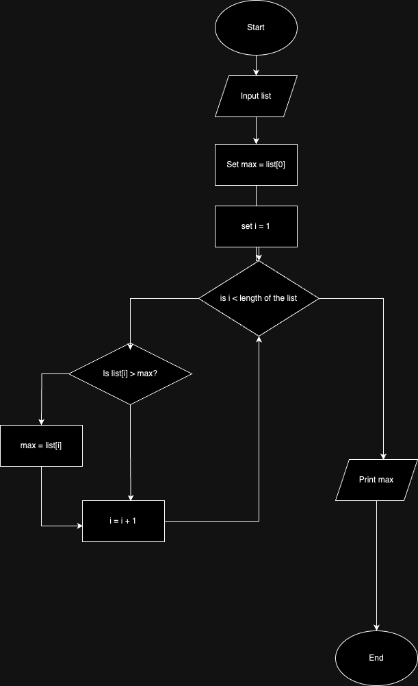

# Flowchart
- A diagram that represents a process or an algorithm
- Has various boxes with different meaning. Each box are connected to define a logic
- Importance: To visualise the flow of the program for easier understanding and debugging

## Flowchart symbols
- Oval: Used to represent Start/End
- Rectangle: Process/Step
- Diamond: Decision point (e.g. IF conditions)
- Parallelogram: Input/Output
- Arrow: Flow

## Tools
- draw.io
- lucidchart
- Visual Paradigm
- Pen & Paper

## Examples
- Example 1: Calculate the sum of two numbers

- Example 2: Create a flowchart for finding the maximum number in a list
